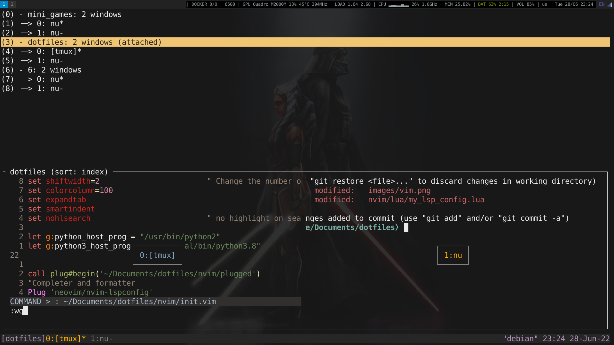

# Rolfie's dotfiles

This repo aims to store all my linux configs ! 

## Dependencies
  (Some dependencies can be installed threw Makefile)

 - [rust](https://www.rust-lang.org/tools/install) (cargo) `curl --proto '=https' --tlsv1.2 -sSf https://sh.rustup.rs | sh`
 - terminal
    - [alacritty](https://github.com/alacritty/alacritty) `cargo install alacritty`
    - [tmux](https://github.com/tmux/tmux) `apt install tmux`
    - [compton](https://github.com/chjj/compton) `apt install compton`
    - [starship](https://github.com/starship/starship) `cargo install starship`
    - [xclip](https://github.com/astrand/xclip): `apt install xclip`
    - [bat](https://github.com/sharkdp/bat): `cargo install --locked bat`
    - [ripgrep](https://github.com/BurntSushi/ripgrep): `cargo install ripgrep`
 - vim
    - [vim-plug](https://github.com/junegunn/vim-plug)
    - [neovim](https://github.com/neovim/neovim)
 - Desktop manager
    - [i3](https://github.com/i3/i3)
    - [i3status-rust](https://github.com/greshake/i3status-rust)

## Install 
A Makefile is there to help me keep easy installation of my setup **DO NOT**
just use `make` on this file, are it will install everything !

- alacritty: `make alacritty`
- basic unix tools: `sudo make tools`
- first neovim install: `make neovim-first` 
- vim-update: `make neovim`

  `:PlugInstall` inside of vim to install plugins

  `:PlugUpdate` inside of vim to update plugins

  **Before using lsp completion**, you might need some [requirements](https://github.com/neovim/nvim-lspconfig)

