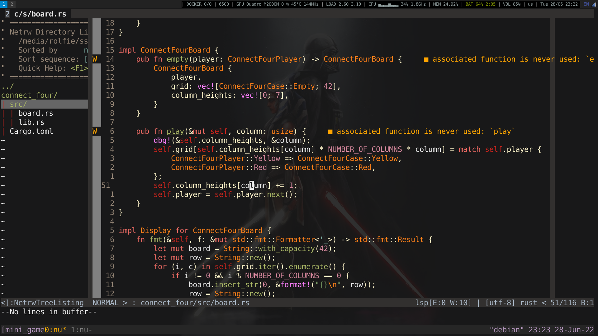

# Rolfie's dotfiles

This repo aims to store all my linux configs ! 

## Dependencies
  (Some dependencies can be installed threw Makefile)

 - rust (cargo)
    rustup: curl --proto '=https' --tlsv1.2 -sSf https://sh.rustup.rs | sh

 - terminal
    [alacritty](https://github.com/alacritty/alacritty)
    [tmux](https://github.com/tmux/tmux) 
    [compton](https://github.com/chjj/compton)
    [starship](https://github.com/starship/starship)
    xclip: apt install xclip
    bat: cargo install --locked bat
    ripgrep: cargo install ripgrep

 - vim
    [vim-plug](https://github.com/junegunn/vim-plug)
    [neovim](https://github.com/neovim/neovim)

 - Desktop manager
    [i3](https://github.com/i3/i3)
    [i3status-rust](https://github.com/greshake/i3status-rust)

  

## Install 
A Makefile is there to help me keep easy installation of my setup  **DO NOT**
just use `make` on this file, are it will install everything !

- alacritty: `make alacritty`
- basic unix tools: `sudo make tools`
- vim: `make neovim` (do `make vim-plug` if never installed)
- vim-update: `make neovim-build`
  `:PlugInstall` inside of vim to install plugins
  `:PlugUpdate` inside of vim to update plugins
  **Before using lsp completion**, you might need some [requirements](https://github.com/neovim/nvim-lspconfig)

